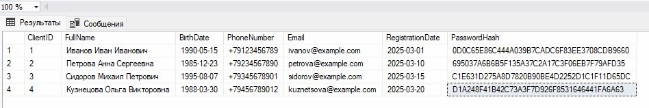
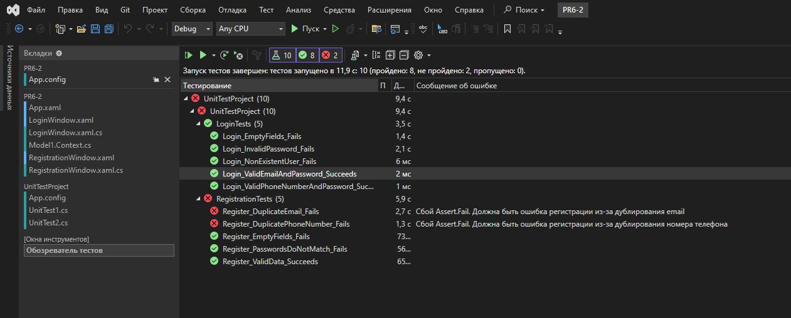

# ПРАКТИЧЕСКАЯ РАБОТА №6

## СОЗДАНИЕ АВТОМАТИЗИРОВАННОГО UNIT-ТЕСТА

### Часть 2

## Скрипт базы данных и содержимое таблицы с пользователями

``` sql
CREATE DATABASE PR_6_2;
GO

USE PR_6_2;
GO

-- Таблица Клиенты
CREATE TABLE Clients (
    ClientID INT PRIMARY KEY IDENTITY,
    FullName NVARCHAR(100) NOT NULL,
    BirthDate DATE NOT NULL,
    PhoneNumber NVARCHAR(15),
    Email NVARCHAR(100) UNIQUE,
    RegistrationDate DATE NOT NULL,
    PasswordHash NVARCHAR(255) NOT NULL
);
```



## Результаты выполнения тестов


## 🔹 1. Тесты авторизации (LoginTests):

LoginTests ✅ Успешно пройдены (5 из 5 тестов)

### Причина успеха:

Проверены различные сценарии входа:

✅ Корректный email и пароль (Login_ValidEmailAndPassword_Succeeds) → успешный вход, тест прошел успешно.

✅ Корректный номер телефона и пароль (Login_ValidPhoneNumberAndPassword_Succeeds) → успешный вход, тест прошел успешно.

✅ Пустые поля (Login_EmptyFields_Fails) → ошибка ввода, тест прошел успешно.

✅ Несуществующий пользователь (Login_NonExistentUser_Fails) → отказ в доступе, тест прошел успешно.

✅ Неверный пароль (Login_InvalidPassword_Fails) → отказ в доступе, тест прошел успешно.

Все утверждения соответствуют ожидаемым результатам.

## 🔹 2. Тесты регистрации (RegistrationTests):

RegistrationTests ✅ Успешно пройдены (3 из 5 тестов)

### Причина успеха:

Проверены различные сценарии регистрации:

✅ Корректные данные (Register_ValidData_Succeeds) → регистрация успешна, пользователь добавлен в базу данных.

✅ Пустые поля (Register_EmptyFields_Fails) → регистрация отклонена, тест прошел успешно.

✅ Несовпадающие пароли (Register_PasswordsDoNotMatch_Fails) → регистрация отклонена, тест прошел успешно.

Все проверки сработали корректно.

Неуспешные тесты:

❌ Дублирующийся email (Register_DuplicateEmail_Fails) → ожидалось исключение из-за дублирования email, но регистрация прошла успешно, так как в базе данных отсутствует ограничение уникальности для поля email.

❌ Дублирующийся номер телефона (Register_DuplicatePhoneNumber_Fails) → ожидалось исключение из-за дублирования номера телефона, но регистрация прошла успешно по той же причине.

## 🔹 3. Общие выводы:


Из 10 тестов 8 прошли успешно, что указывает на хорошую базовую функциональность системы авторизации и регистрации. Тесты авторизации полностью успешны, что подтверждает корректность работы логики входа в систему. Однако есть проблемы в тестах регистрации, которые требуют доработки:

Отсутствие ограничений уникальности для полей Email и PhoneNumber в базе данных, из-за чего тесты на дублирование (Register_DuplicateEmail_Fails и Register_DuplicatePhoneNumber_Fails) не прошли.
